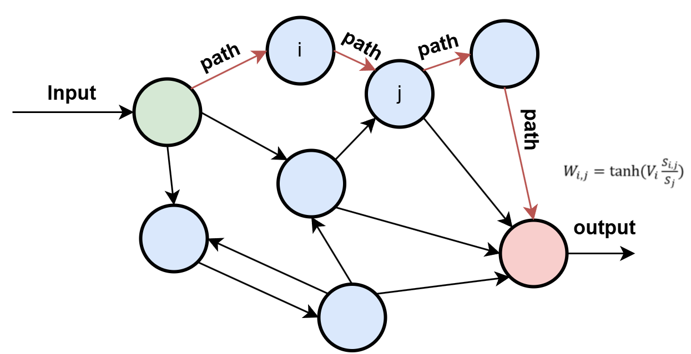

# Drosophila Optic Lobe Neural Network Simulation

## Project Overview
This repository contains code for simulating and analyzing neural pathways in the Drosophila optic lobe, with applications in bionic vision technologies. The project focuses on understanding the functional responses of Lobula Columnar (LC) neurons through connectome data analysis and bioinspired neural network modeling.

## Key Features
- ​**Neural Pathway Analysis**: Depth-first search (DFS) model for tracing pathways from LC neurons to Lamina neurons
- ​**Receptive Field Classification**: Spatial statistical methods to classify neuron receptive fields into:
  - Object Receptive Field (ORF)
  - Direction Receptive Field (DRF)
- ​**Bioinspired Neural Network**: Predictive model for visual response outcomes of LC neurons
- ​**Visual Simulation Tools**: Includes raster motion simulation and response visualization



## Installation & Usage
1. Clone the repository:
   ```bash
   git clone https://github.com/jumping321/CBPW.git
   python ORF_analysis.py L1,L2,L3
